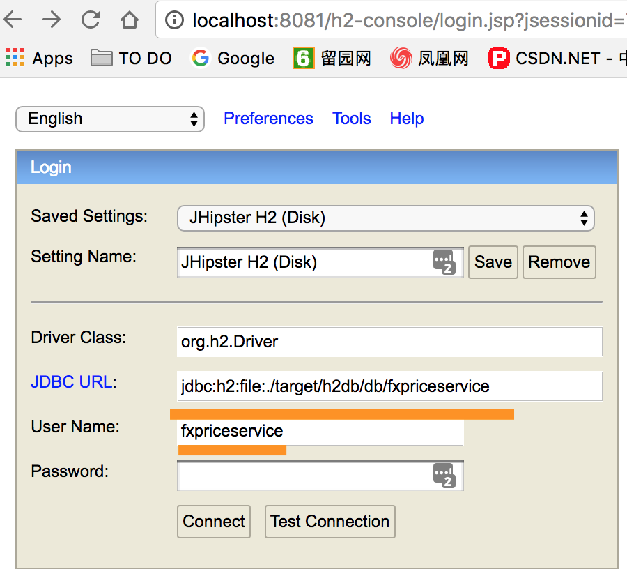

1. liquibase check sum validation error

Error similar to:

    liquibase.exception.ValidationFailedException: Validation Failed:
     1 change sets check sum
          config/liquibase/changelog/20171204141213_added_entity_CurrencyMap.xml::20171204141213-1::jhipster was: 7:6e63e0d1f53e3a328d8d27dbaf4260a2 but is now: 7:8a73d15536bf05a02e08da88c229d758
          
Fix:
run

    mvn liquibase:clearCheckSums 
    
if does not work,
solution 1: remove the related database docker image, i.e. fx-price-service mysql image
solution 2: disable liquibase checksum validation by 
    adding _validCheckSum_ to the top of your changeSet, like this:

    <changeSet>
        <validCheckSum>ANY</validCheckSum>
        <!-- the rest of your changeSet here -->
    </changeSet>
    
solution 3: for services run locally, remove h2 db file.
and rebuild and then ./mvnw to restart the service.

2. Enable h2 web console for price service locally.

    edit 'application-dev.yml' in fx-price-service module
        
    ``    h2:
              console:
                  enabled: true``
                  
    run mvn in fx-price-service module (command line).
    
    h2 console url: http://localhost:8081/h2-console
    
    h2 console connection:
    JDBC URL: jdbc:h2:file:./target/h2db/db/fxpriceservice
    username: fxpriceservice
    
     

    
3. 