# Continuous Integration and Deployment to Google Kubernetes
This document is to describe the process for setting up continuous integration and continuous deployment with google Kubernetes cloud.
The system is built with microsevices architecture. 

## Overview:
1. Code is developed locally, and pushed to Github. 
2. Jenkins (set up in Google compute engine) builds, packages the application as docker image.
3. Jenkins pushes the application to docker image repository.
4. Jenkins triggers the deployment script to deploy the application to Google cloud platform.

# NOTE
**Use google _preemptible_ VM to reduce the cost significantly (around 80% off compared to standard google VM pricing)**

also refer to: (http://www.jhipster.tech/kubernetes/)

## Perquisites
* Jhipster version: 4.7.0
* Jenkins version: 2.6.*

## Set up Jenkins in Google Computer Engine

1. From Google Cloud Platform, Use Google Deployment Management to install Jenkins image (Created by Google, **NOT** Bitnami)
 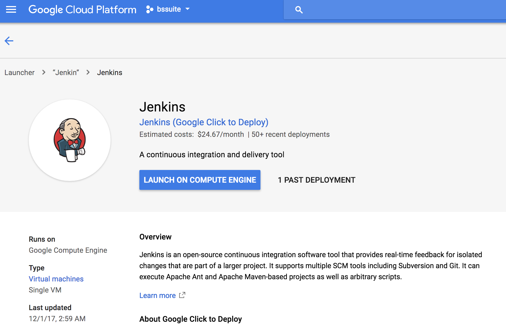
 
 VM instance details:
 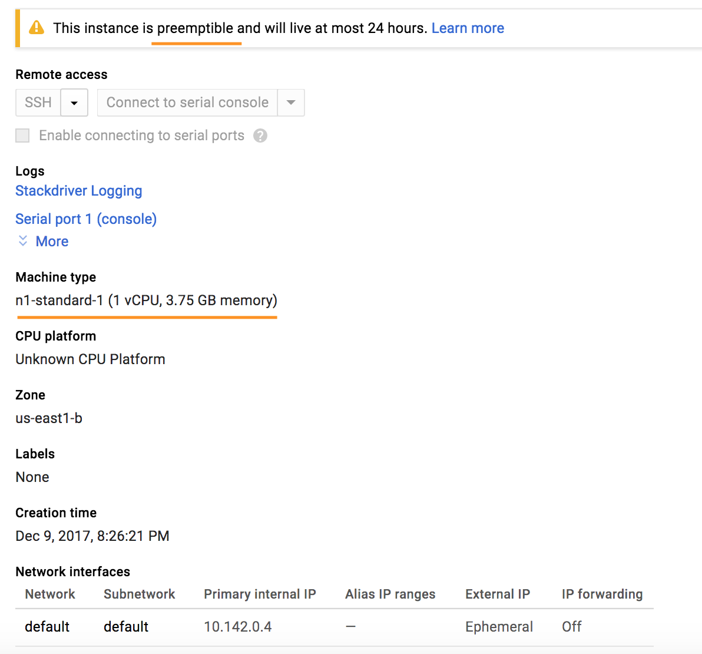
 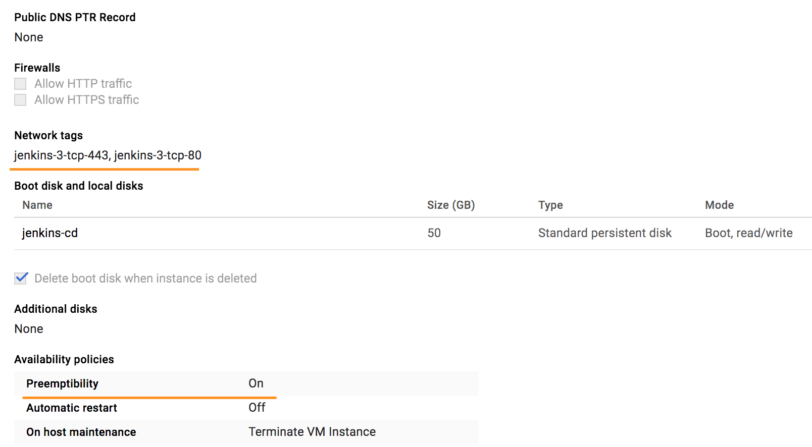
 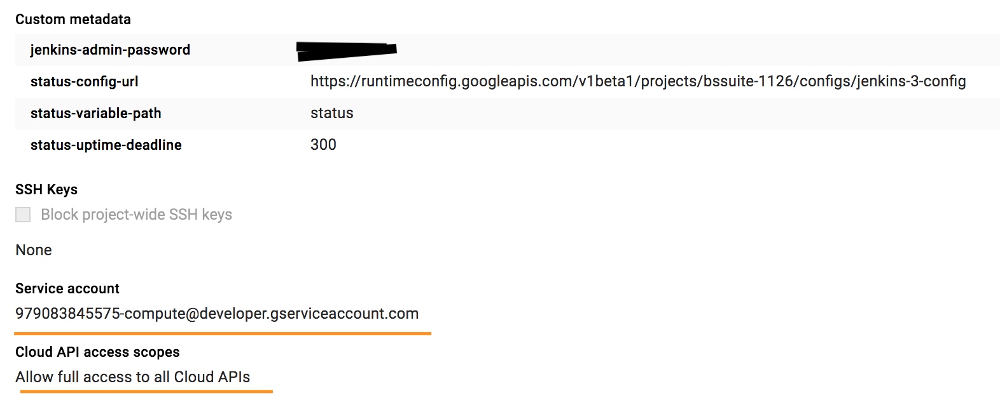

* Use Preemptible VM
* At least n1-standard-1 machine type
* network tag: jenkins-3-tcp-443, jenkins-3-tcp-80 (for firewall config, otherwise jenkins will not be accessible from external)
* Allow full access to all Cloud APIs (so that Jenkins will be able to deploy app to Google kubernates from this VM)
* Service account (need to set up this service account as project owner to be able to create K8 cluster from this VM)

1.1 Set the Jenkins VM service account as project owner
 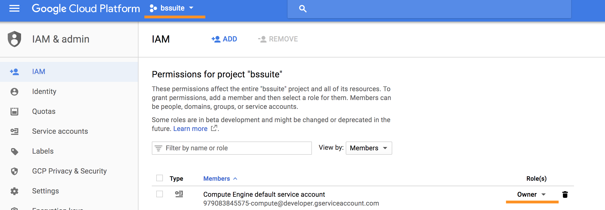
 
1.2 Jenkins VM custom meta data
Those are auto-generated when the vm is created using Google's Jenkins image.
```
jenkins-admin-password	
*****
status-config-url	
https://runtimeconfig.googleapis.com/v1beta1/projects/bssuite-1126/configs/jenkins-3-config
status-variable-path	
status
status-uptime-deadline	
300
```

2. From Google cloud console, SSH into the server and install Git (apt-get install git) and **Oracle JDK** (https://www.mkyong.com/java/how-to-install-oracle-jdk-8-on-debian/)
 
3. Set up the server env.
* Set JAVA_HOME Environment Variable
```
sudo nano /etc/environment
```
In this file, add the following lines, make sure to replace the highlighted path with your own copied path.
```
/etc/environment
JAVA_HOME="/usr/lib/jvm/java-8-oracle"
```
Save and exit the file, and reload it.

```
source /etc/environment
```
You can now test whether the environment variable has been set by executing the following command:

    echo $JAVA_HOME

This will show the path you just set.

4. Install docker
Install docker (for Debian 9, x86_64 Arch)
    https://docs.docker.com/engine/installation/linux/docker-ce/debian/#install-docker-ce-1
    
at the last step, run

    sudo docker run hello-world
   
to verify docker is installed correctly.

5. Solve docker permission issue for logged-in user (SSH login)

run:

    sudo usermod -a -G docker $USER
            
then log out and log back in.
refer to:
    https://techoverflow.net/2017/03/01/solving-docker-permission-denied-while-trying-to-connect-to-the-docker-daemon-socket/

6. Solve docker permission issue for Jenkins
Add username "jenkins" to Docker group, so that jenkins script can run docker commands.(similar to step 5).
To check the username of jenkins server (in Jenkins build file, add "sh whoami")
```
sudo usermod -a -G docker jenkins 
```
7. docker hub login for logged-in user (SSH login)
docker login to be able to push docker images to the public docker registry (docker hub) 
```
docker login
```
then enter docker hub username and password

8. docker hub login for Jenkins user (jenkins)
CONFIGURING DOCKER HUB WITH JENKINS
To store the application Docker image built by jenkins, we'll be using Docker Hub. 
You can sign up for a free account at [docker hub](https://hub.docker.com)

We'll need to give Jenkins access to push the image to Docker Hub. For this, we'll create Credentials in Jenkins, and refer to them in the Jenkinsfile.

On the Jenkins front page, click on Credentials -> System -> Global credentials -> Add Credentials
 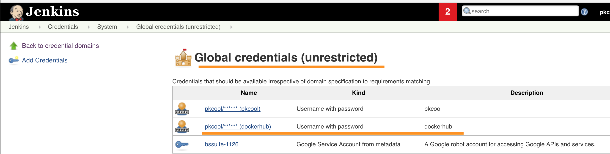

Add your Docker Hub credentials as the type Username with password, with the ID (i.e. docker-login)
 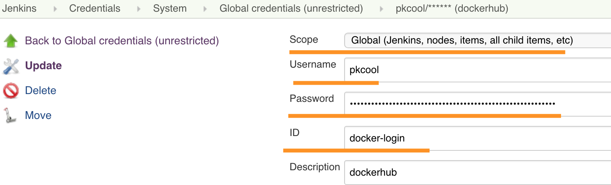


ref: (https://getintodevops.com/blog/building-your-first-docker-image-with-jenkins-2-guide-for-developers)

8. Set up a Jenkins job to login to docker hub for Jenkins.
The docker login is necessary for jenkins, so jenkins jobs will be able to push docker images to docker hub.
This is job is usually only need to run once, as long as system does not ask for login credentials. 

create a Jenkins freestyle job to do docker hub login.
in "Build Environment" section, select "Use secrete text or files"
Bindings (example):

    select "Username and password (separated)", username variable: "DH_USERNAME", password variable: "DH_PASSWORD", credentials: select the credential set up in the previous step.

 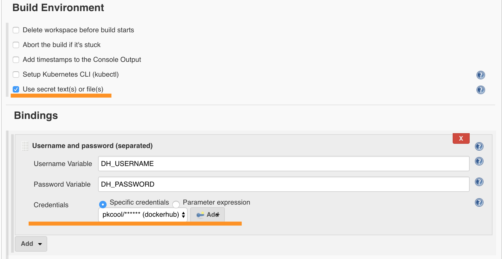

in "Build" section, select "Execute Shell", and enter the shell script:

    #!/bin/bash
    docker login -u $DH_USERNAME -p $DH_PASSWORD

 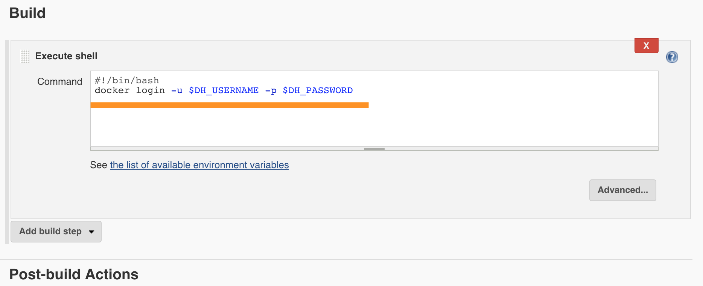

after this step, should be able to push docker image to docker hub from Jenkins job using command such as: 

    sh "docker push pkcool/fxpriceservice"
    
## Set up for deployment to Google Kubernetes from Jenkins
SSH into Jenkins server.

1. install Google cloud SDK (for Debian)
follow: https://cloud.google.com/sdk/downloads#apt-get

 >   You can install the Cloud SDK from a Debian/Ubuntu package for all official Ubuntu releases that have not reached end of life, and Debian stable releases from Wheezy forward.
    
 >   Note: If you are using an instance on Google Compute Engine, Cloud SDK is installed by default. You can still manually install Cloud SDK using the instructions below.
    
 >  1. Create an environment variable for the correct distribution:
    export CLOUD_SDK_REPO="cloud-sdk-$(lsb_release -c -s)"
    
 >   2. Add the Cloud SDK distribution URI as a package source:
    echo "deb http://packages.cloud.google.com/apt $CLOUD_SDK_REPO main" | sudo tee -a /etc/apt/sources.list.d/google-cloud-sdk.list
    If you have apt-transport-https installed, you can use "https" instead of "http" in this step.
    
 >   3. Import the Google Cloud public key:
    curl https://packages.cloud.google.com/apt/doc/apt-key.gpg | sudo apt-key add -
    
 >   4. Update and install the Cloud SDK:
    sudo apt-get update && sudo apt-get install google-cloud-sdk
    
 >   5. Optionally install any of these additional components:
    google-cloud-sdk-app-engine-python
    google-cloud-sdk-app-engine-java
    google-cloud-sdk-app-engine-go
    google-cloud-sdk-datalab
    google-cloud-sdk-datastore-emulator
    google-cloud-sdk-pubsub-emulator
    google-cloud-sdk-cbt
    google-cloud-sdk-bigtable-emulator
    kubectl
    For example, the google-cloud-sdk-app-engine-java component can be installed as follows:
      sudo apt-get install google-cloud-sdk-app-engine-java
    
 >   6. Run gcloud init to get started:
     gcloud init

1.1 Install kubectl component using google cloud sdk

1.2 Login to Google Cloud 

    gcloud init
    
To check the authentication list:

    gcloud auth list
    
 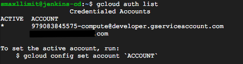
 
To switch between service account and the other account (i.e. owner account )

    gcloud config set account 'account'
    
The step 2 will set up Jenkins to use the service account, so all jenkins jobs will be able to make changes to kubernetes cluster.
i.e. create cluster, deploy application to kubernetes cluster.

Optional settings:
* set  a default project
```
    gcloud config set project [PROJECT-ID]
```
Project ID can be found from:
 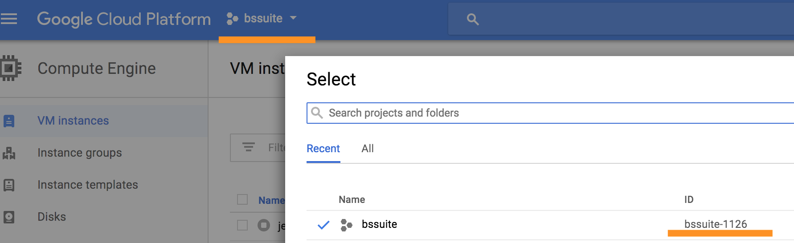

   
2. Install plugins for Jenkins
From Jenkins plugin manager, install the 2 plugins:

 'Kubernetes plugin' and Google Authenticated Source plugin.
 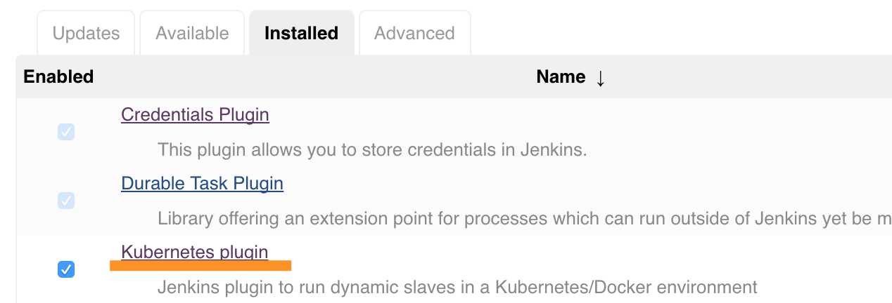
 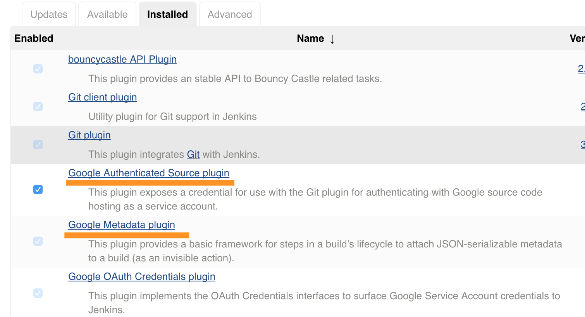


ref: (https://cloud.google.com/solutions/configuring-jenkins-kubernetes-engine)

3. Jenkins config to use the service account 
 

> Adding Google service account credentials
 
> These credentials enable Jenkins to leverage your Kubernetes Engine cluster's service account to create, view, and delete cloud resources.
 
>  1. In Jenkins, click **Credentials**, then click **System** in the left navigation.
>  2. Click **Global credentials (unrestricted)**.
>  3. Click **Add Credentials** in the left navigation.
>  4. Select **Google Service Account from metadata** from the **Kind** dropdown.
>  5. Click the **OK** button.

ref: (https://cloud.google.com/solutions/configuring-jenkins-kubernetes-engine)

To verify:
create a free style jenkins job, to check the active google cloud account used by Jenkins job. 
 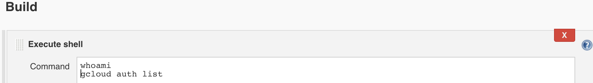

the output could be:
 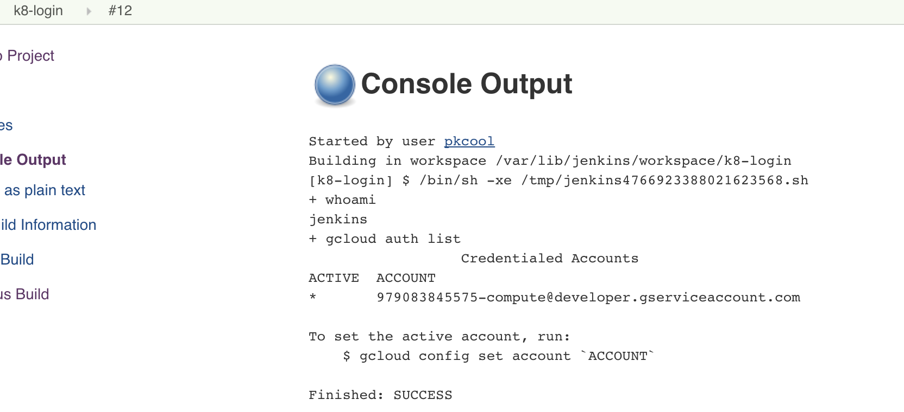

4. Enable access scope for the compute engine (service account: 979083845575-compute@developer.gserviceaccount.com)
otherwise, jenkins job will fail (Permission issue),this is done when creating Jenkins VM, or can be changed any time in VM settings.
Use "full access" option for access scope.

## Jenkins pipeline Job:
pipe line config:
 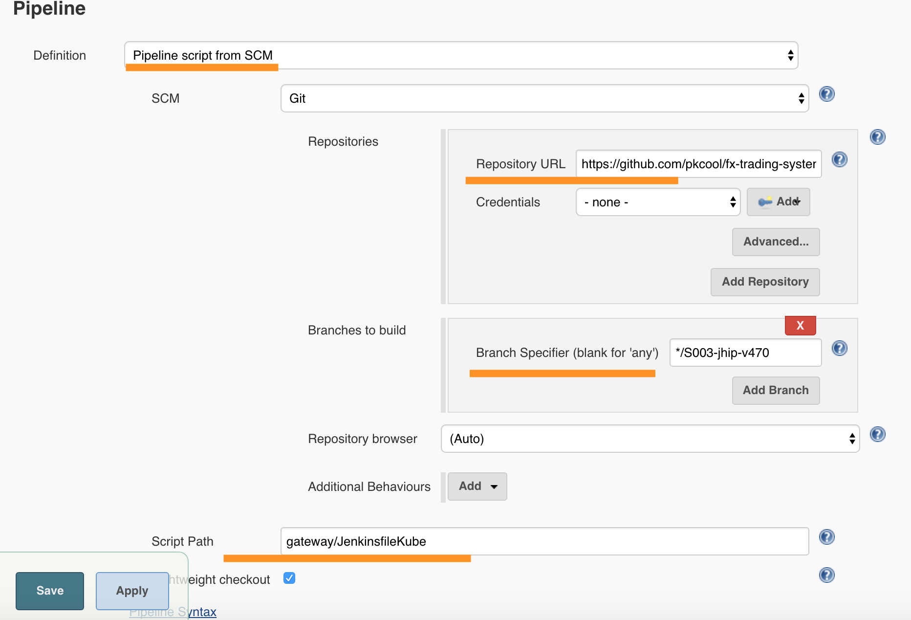

## After deployment
1. Find external IP of gateway from Google Kubernetes Engine.

2. Expose other services to external traffic.
i.e. to expose jhipster registry, in Jenkins build file, add:
```
sh "kubectl expose service jhipster-registry --type=LoadBalancer --name=exposed-registry"
```
the type should be "LoadBalancer" so the external IP will be assigned to the service.
(NOTE: load balancer is not FREE)
The external IP can be found from Google Kubernetes Engine console, or by:

    kubectl get service exposed-registry

ref: (https://cloud.google.com/kubernetes-engine/docs/quickstart)

3. To delete a kubernetes cluster:
* Delete the cluster from Google console,

alternatively, 

* In jenkins file, add
    ```
    sh "gcloud container clusters delete CLUSTER_NAME"
    ```
    replace CLUSTER_NAME with cluster name, i.e. fxts-kube


# Tips
* Set Alias in bash profile 
* Enable "Discard old builds" for jenkins jobs to save storage space. 
 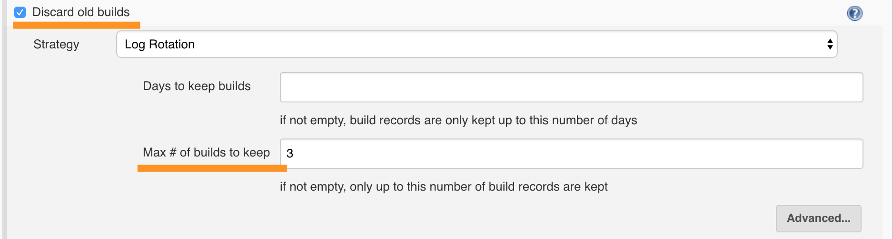


# References:
* https://cloud.google.com/solutions/continuous-delivery-jenkins-kubernetes-engine#deploying_a_canary_release
* Adding Google service account credentials: https://cloud.google.com/solutions/configuring-jenkins-kubernetes-engine
* http://www.jhipster.tech/kubernetes/