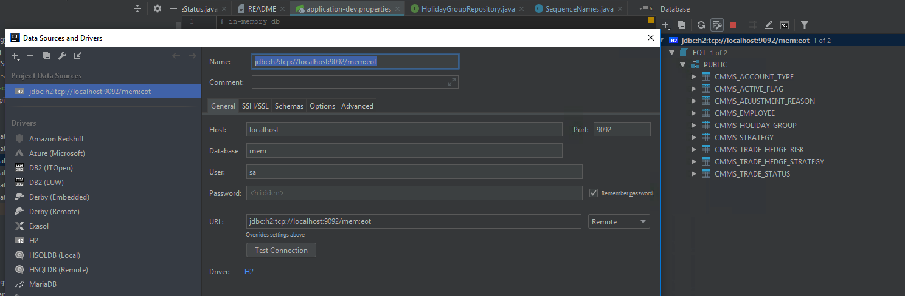

URL:
https://techdev.io/en/developer-blog/querying-the-embedded-h2-database-of-a-spring-boot-application

configuration (application properties file):

    # in-memory db
    
    spring.datasource.driverClassName=org.h2.Driver
    spring.datasource.url=jdbc:h2:mem:eot;DB_CLOSE_DELAY=-1;DB_CLOSE_ON_EXIT=FALSE
    spring.datasource.username=sa
    spring.datasource.password=
    
    spring.jpa.database-platform=org.hibernate.dialect.H2Dialect
    spring.jpa.database=h2
    spring.jpa.properties.hibernate.id.new_generator_mappings=true
    
    # Enabling H2 Console (URL: http://localhost:8020/h2-console)
    spring.h2.console.enabled=true
    
    h2.tcp.enabled=true
    h2.tcp.port=9092
    
h2 connection:
     

