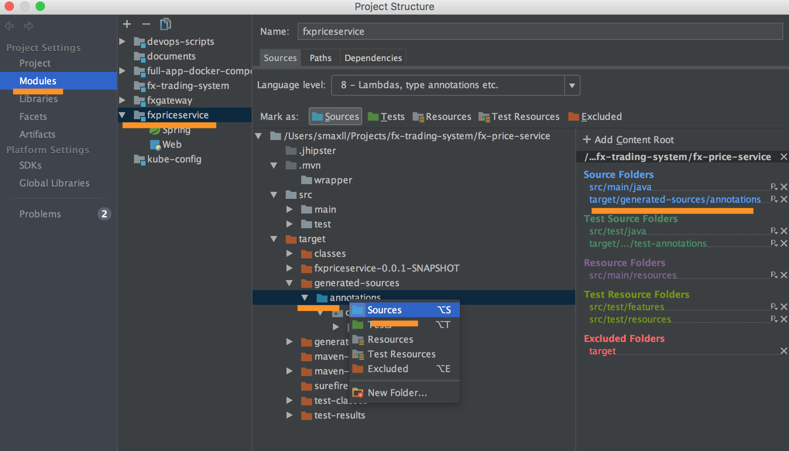
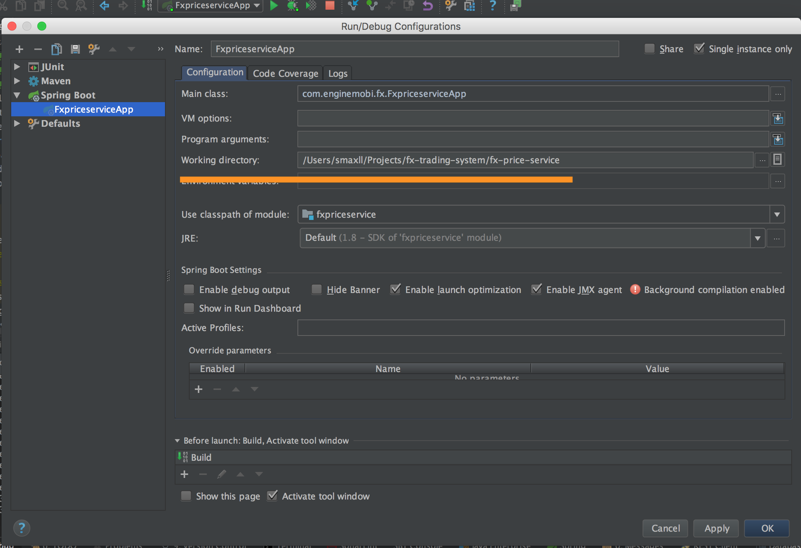

# Intellij

1. Enable jpa metamodel generation
After meta model code is generated, the generated source is not recognized in Intellij by default.
Need to config Intellij by add generated code as source:
 
 
 Add generated test resource if needed.
 
 
2. Run fx-price-service from Intellij
After running Run "mvn" from command line in fx-price-service module, 
fxpriceservice package with dev profile will be built and h2 database file generated.

then, Execute **_FxpriceservieApp_** in IDE.
NOTE: 
in Run/Debug configuration area, 
working directory should be set to fx-price-service directory, 
otherwise FxpriceserviceApp config will use root-module as working directory,
subsequently generate h2 database file in root-module/target/db/ directory.

 

